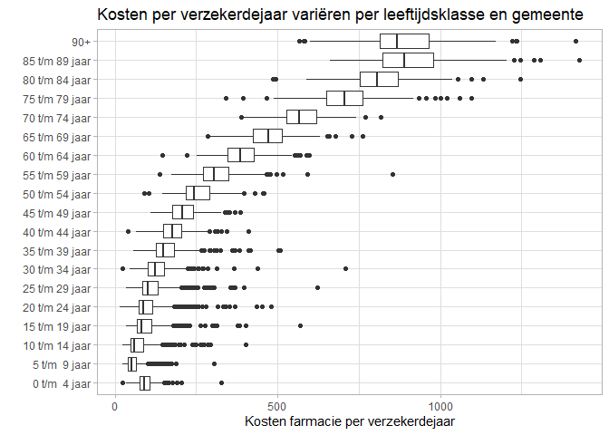

Test met Github
================

## Test met Github

This repo is a test project to investigate Github’s different options.

First load the necessary packages:

``` r
library(tidyverse)
library(here)
```

## Data download

Download data from the Vektis website and write to disk.

``` r
url <- 
  "https://www.vektis.nl/uploads/Docs%20per%20pagina/Open%20Data%20Bestanden/2018/Vektis%20Open%20Databestand%20Zorgverzekeringswet%202018%20-%20gemeente.csv"

datafile <- here("data", "Kostensoorten_gemeente_2018.csv")

download.file(url, datafile)
```

## Data wrangle

Read data in memory and start cleaning.

``` r
data <-
  readr::read_delim(here::here("data", "Kostensoorten_gemeente_2018.csv"),
                    delim = ";") %>%
  janitor::clean_names()
```

``` r
 data %>%
  group_by(gemeentenaam, leeftijdsklasse) %>% 
  summarise(aantal_bsn = sum(aantal_bsn),
            aantal_verzekerdejaren = sum(aantal_verzekerdejaren),
            kosten_farmacie = sum(kosten_farmacie)) %>% 
  ungroup() %>% 
  mutate(kosten_vj = kosten_farmacie / aantal_verzekerdejaren)  %>% 
  filter(!is.na(gemeentenaam)) %>% 
  ggplot(aes(x = leeftijdsklasse, y = kosten_vj)) +
  geom_boxplot() +
  coord_flip() +
  labs(title = "Kosten per verzekerdejaar variëren per leeftijdsklasse en gemeente",
       y = "Kosten farmacie per verzekerdejaar", x = "") +
  theme_light()
```

<!-- -->
